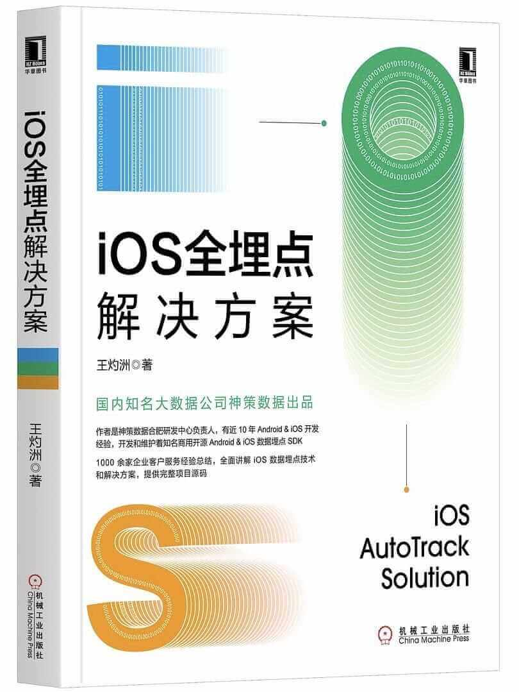

# CCAutoTrack-iOS
The practice of iOS AutoTrack Solution learning and notes.

本项目是学习[《iOS全埋点解决方案》](https://item.jd.com/12867068.html)时的练习和笔记，仅供交流学习，请勿用于商业。

**墙裂推荐**神策数据王灼洲老师的这本书，干货满满。阅读过程中随书籍实现了代码，为加深印象还记了[笔记](notes/《iOS全埋点解决方案》读书笔记.md)。

注：如有版权问题请 issue me。

